# Agent Skills

赋予智能体新能力与专业技能的开放格式。

## 什么是 Agent Skills?

Anthropic 定义的开放规范：[https://agentskills.io/](https://agentskills.io/)

> A simple, open format for giving agents new capabilities and expertise.


## SKILL 的本质

### SKILL 的文件夹结构

本质上是包含 `SKILL.md` 文件的文件夹

```bash
my-skill/
├── SKILL.md          # Required: instructions + metadata
├── scripts/          # Optional: executable code
├── references/       # Optional: documentation
└── assets/           # Optional: templates, resources
```

### SKILL.md 的组成

| 部分 | 说明 |
|------|------|
| **Metadata** | 元数据: name, description 等 |
| **Instructions** | 指令: 自描述、可扩展、可移植 |
| **Resources** | 资源: scripts, references, assets |

### 指令的核心特性

- **Self-documenting 自描述** — 用自然语言描述，作者和用户都能理解
- **Extensible 可扩展** — 从简单文本指令到复杂代码执行、资源管理
- **Portable 可移植** — 就是一个文件夹，轻松修改、版本迭代和分享


## SKILL 是如何工作的?

### 渐进式披露 (Progressive Disclosure)

```mermaid
flowchart LR
    A[Discovery<br/>发现] --> B[Activation<br/>激活]
    B --> C[Execution<br/>执行]

    style A fill:#FF6B6B
    style B fill:#4ECDC4
    style C fill:#45B7D1
```



### 三个阶段详解

1. **Discovery 发现** — Agent 启动时，只加载所有 SKILL 的元数据 (name, description)。Agent 只需知道什么任务用哪个 SKILL。

2. **Activation 激活** — 当 Agent 执行任务时，上下文匹配到元数据描述的 SKILL，此时才加载完整的 SKILL.md 到上下文中。

3. **Execution 执行** — Agent 根据 SKILL.md 指令，按需加载引用文件或执行指定代码。


## SKILL 规范与格式

### SKILL.md Frontmatter

```yaml
name: pdf-processing
description: Extract text and tables from PDF files, fill forms, merge documents.
license: Apache-2.0
metadata:
  author: example-org
  version: "1.0"

```

**必须字段**: `name`, `description`

**可选字段**: `license`, `compatibility`, `metadata`, `allowed-tools`

### Body Content 建议

没有严格格式要求，让 Agent 能有效执行指令即可。

**推荐包含的部分:**

- 分步操作说明
- 输入输出示例
- 常见边界情况

### 目录结构详解

- **`scripts/`** — 可执行代码。自包含或注明依赖，包含有用的错误提示，优雅处理异常情况，支持 Python, Bash, JavaScript 等。

- **`references/`** — 额外文档资料。如 REFERENCE.md、FORMS.md、领域专用文档 (finance.md, legal.md)。建议拆分成小文件，按需加载。

- **`assets/`** — 静态资源。文档模板、配置模板、图片流程图、数据文件与 schema。

### 渐进式披露的资源建议

```
┌─────────────────────────────────────────────────┐
│  Metadata:       ~100 tokens                    │
├─────────────────────────────────────────────────┤
│  Instructions:   < 5000 tokens (recommended)    │
├─────────────────────────────────────────────────┤
│  Resources:      as needed                      │
│  • scripts/, references/, assets/               │
└─────────────────────────────────────────────────┘
```

保持 SKILL.md < 500 行，详细指令放到 references 按内容拆分。


## Skill vs MCP

### 核心区别

Agent Skill 是 **"你会干什么"**，而 MCP 是 **"你如何与外界沟通的语言标准"**。

### 定义对比

**Agent Skills — 指令集 / 技能手册**

本地 Markdown 文件，用自然语言告诉 Agent：

> _"如果你要干 X，就按照 A->B->C 的步骤去执行。"_

**MCP — 接口标准 / 标准插座**

用代码定义稳定的通道，让 Agent 安全地访问数据库、Docker、远程服务器，解决 **"怎么连"** 的问题。

### 维度对比表

| 维度 | Agent Skills (核心是指令) | MCP (核心是连接) |
|------|---------------------------|------------------|
| **形式** | **.md 文件**（自然语言定义逻辑） | **JSON-RPC 服务**（代码定义接口） |
| **编写门槛** | **极低**。懂业务逻辑就能写。 | **中等**。需要写程序、打镜像。 |
| **运行位置** | **本地工作区**。随项目代码走。 | **隔离环境**。如 Docker 或远程 Server。 |
| **执行成功率** | 依赖 LLM 实时推理，环境差异大。 | **极高**。环境标准化，屏蔽系统差异。 |

### 实战场景对比

**1. 代码重构 — Skill 胜出**

在项目里放个 `refactor.md`，写着 "用 Rails 7 的新语法重构这个 Controller"。Agent 读了指令直接在本地改代码，不需要写任何代码来驱动这个过程。

**2. 生产环境数据库查询 — MCP 胜出**

部署一个 MCP Server 连接生产库，提供受控的 API，Agent 通过 MCP 协议发起请求。因为涉及权限和复杂查询，用标准化的代码接口更安全、更稳定。

### 形象化比喻

**比喻 1: 菜谱 vs. 预制菜生产线**

- **Skill 是"菜谱"** — 告诉厨师（Agent）怎么做。厨师在自己厨房（本地环境）做，能不能做成看厨师发挥和厨房调料够不够。
- **MCP 是"预制菜线"** — 厨师只要按下按钮，工厂（Docker/Remote）就出一个标准口味的成品。不需要厨师动脑子，**成功率 100%**。

**比喻 2: 游戏攻略 vs. 游戏手柄**

- **Skill 是"攻略"** — 告诉玩家"先跳再开火"。玩家（Agent）利用游戏自带的动作（本地工具）去完成。
- **MCP 是"特制手柄"** — 给游戏增加了一个"一键大招"的实体按键。只要按下去，协议就会强制执行预设好的复杂动作。


## 快速上手

### 如何使用 SKILL

官方仓库: [https://github.com/anthropics/skills](https://github.com/anthropics/skills)

以 **brand-guidelines** Skill 为例。

### Claude 中使用

**安装插件**

```bash
/plugin marketplace add anthropics/skills
/plugin install example-skills@anthropic-agent-skills
```

**使用 Prompt**

```
帮我写一个简单的 HTML/CSS 卡片，用来展示 "AI 安全原则"，
请使用 brand-guidelines 这个 skill 来设计样式,
文件输出到 ai.html
```

### 其他 Agent 支持

主流 Agent 平台都已支持 Skills：

- [OpenCode Skills](https://opencode.ai/docs/skills/#place-files)
- [Cursor Skills](https://cursor.com/docs/context/skills#skill-directories)
- [Antigravity Skills](https://antigravity.google/docs/skills#where-skills-live)

### 跨平台工具: skills

不同 Agent 需要放到不同目录，规则各异。可使用 **[skills](https://npm.im/skills)** CLI 工具：

```bash
npx skills add vercel-labs/agent-skills --skill web-design-guidelines

npx skills add https://github.com/michalparkola/tapestry-skills-for-claude-code/tree/main/article-extractor
```

自动下载并放置到各 Agent 指定目录，无需手工移动。

### 寻找更多 Skills

- https://skills.sh/
- https://github.com/ComposioHQ/awesome-claude-skills


## 编写一个简单的 SKILL

以 **git-commit** SKILL 为例：

```md
name: git-commit
description: Generates human-readable commit messages with leading emoji by analyzing git diff. Use when the user wants to commit, needs a commit message, or asks to summarize staged/unstaged changes. Ignores lock files (e.g. pnpm-lock.yaml).

## What I do

- Analyze `git diff` (or `git diff --staged`) to see what changed
- Produce a single-line commit message starting with an emoji, simple and human-readable
- Prefer ignoring lock/bundle files: `pnpm-lock.yaml`, `package-lock.json`, `yarn.lock`, etc., unless the change is only in those files
- Push to remote

## When to use me

- User wants to run `git commit` or write a commit message
- Include all changes from stash

## Commit message format

- One short sentence
- Start with an emoji, then the message
- Prefer present tense and active voice (e.g. "Add feature" not "Added feature")

## Emoji reference

| Change type        | Emoji | Example                    |
|--------------------|-------|----------------------------|
| New feature        | ✨    | ✨ Add login form          |
| Bug fix            | 🐛    | 🐛 Fix date timezone       |
| Documentation      | 📝    | 📝 Update API readme       |
| Style / format     | 💄    | 💄 Format with prettier    |
| Refactor           | ♻️    | ♻️ Extract auth helper    |
| Performance        | ⚡    | ⚡ Lazy load images       |
| Dependencies       | 📦    | 📦 Upgrade React to 19    |
| Config / tooling   | 🔧    | 🔧 Add ESLint rule        |

Pick the closest type; keep the message concise.
```


## 参考链接

- [https://agentskills.io](https://agentskills.io)
- [https://github.com/anthropics/skills](https://github.com/anthropics/skills)
