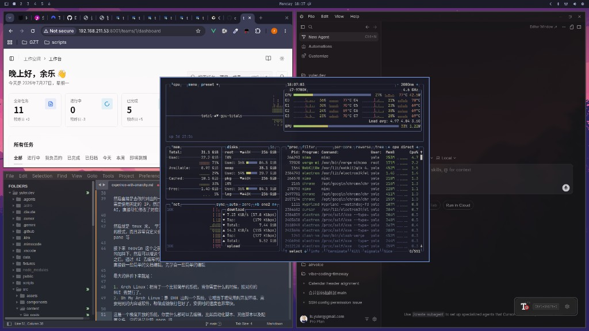
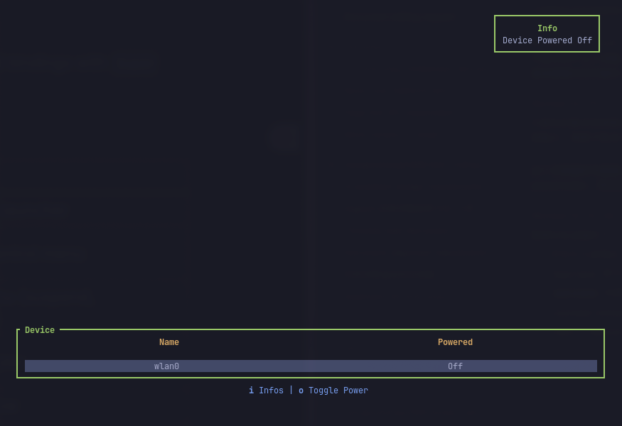
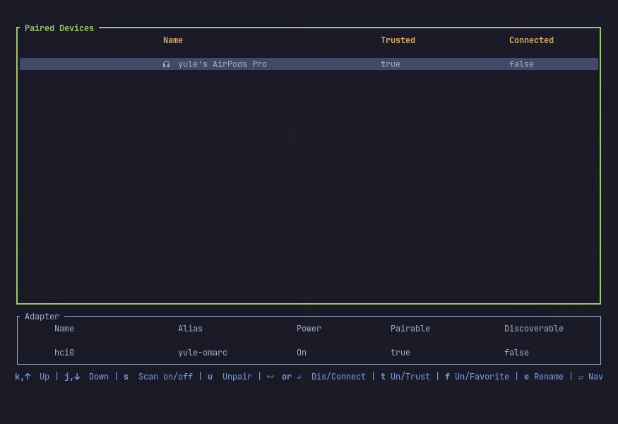
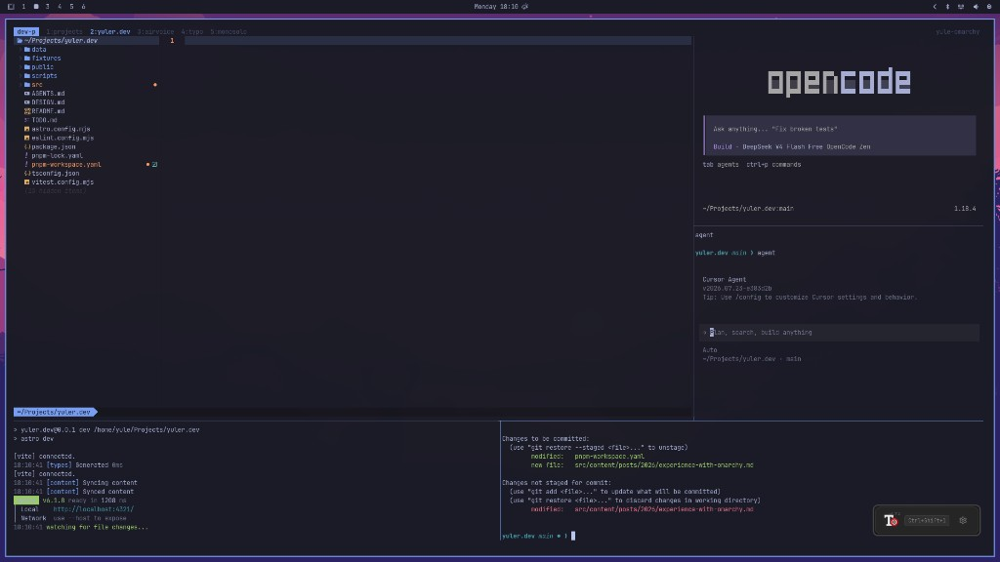

上周，我把办公电脑从 [Omakub](https://omakub.org) 重装成了 [Omarchy](https://omarchy.org)。跟着 DHH 的脚步，一年多 Omakub 老用户，终于踏上了 Arch 这条不归路。

## 迁移准备

迁移前，我把 dotfiles、shell 脚本、SSH 密钥之类的东西，一股脑儿拷到了扩展硬盘上——这台机器正好有个额外的盘，省得折腾网盘或者 U 盘来回倒。

准备工作还算顺利，真正有意思的是烧录系统那一步：我手里有个 U 盘，拼多多上买的杂牌货。用它写 Omarchy 镜像，烧录反复失败，怎么都不行。换了个正经 U 盘，一次成功。

**Lesson learned**：系统安装这种事，别跟拼多多赌运气。

## Hyprland：键盘很爽，眼睛还在适应

Omarchy 基于 Hyprland，窗口管理全靠键盘——移动、平铺、放大缩小，全程不用碰鼠标。对习惯了 macOS / 传统桌面的人来说，这操作确实新鲜。

但新鲜归新鲜，习惯是另一回事。Hyprland 默认是 Dwindle 平铺模式：每开一个新窗口，系统就自动给你排成瓦片，整整齐齐，一个叠一个。视觉上挺克制，窗口也不会莫名消失在某个角落——好处是有的。

坏处是：它太积极了。

比如微信里点开一张图片，啪，弹出一个新窗口，整个桌面立刻重排。不是那种轻飘飘浮在上面的 float 弹窗，而是「欢迎新成员，大家挤一挤」的平铺逻辑。每次都被吓一跳，至今还没完全习惯。好在系统也支持 float + pin 模式，算是留了一条后路。

## 极致快捷键

说到 Hyprland，得单独夸一句：它的快捷键做得有点“过分专业”。DHH 把键盘当成主操作方式，Omarchy Linux 这套配置里快捷键覆盖得非常全面，官方汇总也很详细：<https://learn.omacom.io/2/the-omarchy-manual/53/hotkeys>

大致可以分成几类（而且每类都很“能干活”）：

1. 导航与显示控制：导航控制、显示器控制、显示器亮度调节等。
2. APP 启动：启动各种 APP 的快捷键；并且很多 APP 下面还有各自更细的快捷键说明。
3. 系统内置功能：内置剪贴板历史记录、截图通知、Reminder 等。
4. 终端功能：终端里和 `tmux`、`Neovim` 相关的一整套快捷键。

更夸张的是，这套快捷键很强大：它需要你不断地体验和操作，慢慢把“按下去会发生什么”用熟。

等熟悉之后，效率就会不断提升——现在我还在适应期，所以偶尔也会冒出“我知道能搞定，但忘了按哪条”的念头。

## 终端里的 WiFi 和静态 IP

另一件让我愣住的事：连 WiFi 也是终端里搞的。纯文本界面，没有图形向导，第一次点进去连接网络的时候，内心 OS 大概是：「啊？就这？」

不过试了一次之后，反而觉得挺有意思——少了一层 GUI 糖衣，反而更直接。蓝牙也是同一套路，终端里配对、连接、信任，全靠快捷键操作：

办公室这台机器走网线，需要配固定 IP。翻遍了设置，没找到图形界面的入口。最后问 AI，直接改 `/etc/systemd/network/` 下的配置文件，重启网络服务，搞定。

Arch 用户的日常：没有 GUI？那就改文件。没有文件？那就写一个。

## tmux + Neovim：正在搭建的新工作流

这周还在摸索 tmux。它的 layout 能力很强，可以拼出类似 IDE 的多窗格布局，而且高度可定制——用 shell 脚本就能创建 window、tab、pane，玩起来挺上瘾。

Neovim 之前略懂一点，希望在 AI 的加持下，能走通这么一条路线：在 Terminal 里用 tmux 摆好 layout，让 AI 帮忙写代码，再用 Neovim 做轻量文档编辑。先学会基本操作，后面再慢慢深入。

## 一周下来，几点感受

1. **Arch Linux**：需要什么装什么，`pacman` 一把梭。系统本身很干净，不替你做决定。
2. **Omarchy**：DHH 把常用开发环境和工具打包成镜像，安装速度飞快。与其说是发行版，不如说是一份「开箱即用的 Arch 配置」。
3. **极度开放**：启动脚本、配置文件、各种 dotfiles——想改什么改什么，自由度很高，适合喜欢折腾的人。
4. **官方文档**：[omarchy.org](https://omarchy.org) 的文档写得不错，遇到问题先翻文档，再 Google，最后才问 AI——这个顺序目前还挺管用。

总的来说，从 Omakub 迁过来不算轻松，但也不算痛苦。主要成本是重新适应 Hyprland 的窗口逻辑，以及把一部分 GUI 操作换成终端和配置文件。一周下来，已经能正常干活了——只是微信弹图的时候，还是会心里一紧。
