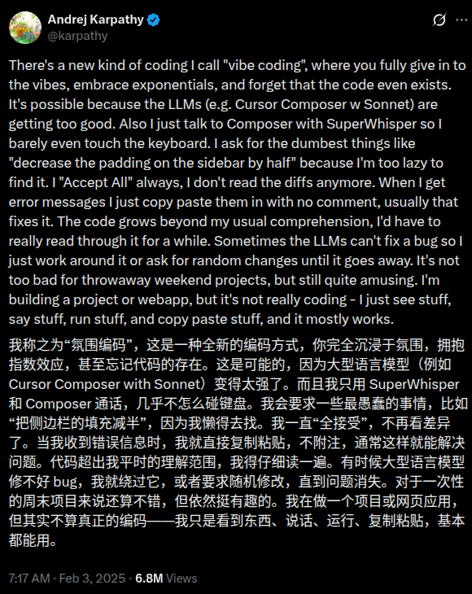
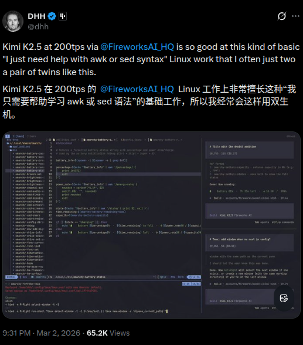

# Vibe-coding

## What's vibe-coding

什么是 vibe coding?

---

**Andrej Karpathy**（安德烈·卡帕斯）：AI 领域著名专家，被业界昵称为 "KP"，曾任 Tesla AI 总监，OpenAI 创始成员。



https://x.com/karpathy/status/1886192184808149383?lang=en

---

维基百科解释

https://zh.wikipedia.org/wiki/Vibe_coding

---

**你只需用自然语言输入你的意图（Vibe），AI 会帮你输出相应的代码，剩下的工作就交给它来完成。**

## Who's vibe-coding?

看看下面这张图


---

**Linus Torvalds**：Linux 之父，Git 的作者


https://github.com/torvalds/AudioNoise#:~:text=basically%20written%20by-,vibe%2Dcoding,-.%20I%20know%20more

---

**Tobi**：Shopify 联合创始人兼 CEO


https://x.com/tobi/status/2026148524140695973, https://github.com/tobi

---

**DHH**：Ruby on Rails 之父



https://x.com/dhh/status/2028463162513871329

---

**Ryan Dahl**：Node.js 和 Deno 的作者


https://x.com/rough__sea/status/2013280952370573666

---

## Famous vibe-coding projects

TODO:

- **[Linux.do 话题 #1697717](https://linux.do/t/topic/1697717)**：Linux 社区里关于 vibe coding 的讨论帖，分享在 Linux 上做 vibe coding 的实践、工具和心得。
- **[ryOS](https://github.com/ryokun6/ryos)**：Cursor 设计负责人 Ryo Lu 用 Cursor 全流程 vibe 出来的「操作系统」—— 在浏览器里跑的怀旧风 OS（复刻 Mac OS X Aqua、System 7、Windows XP/98 等），内置 17 个应用（Finder、终端、iPod 模拟器、时光机浏览器等）、AI 助手 Ryo、虚拟文件系统与多主题，技术栈为 React 19 + TypeScript + three.js，既是作品也是「当界面消失、只剩 vibe」的交互实验。

---

再看看 GitHub 热门榜单： https://github.com/trending?since=monthly

都有一个 [claude](https://github.com/claude) 的头像

## Vibe-coding tools

IDEs, Terminals, Others

---

### AI-Native IDEs


- [Cursor](https://cursor.com/)：基于 VS Code 的 AI 原生 IDE，支持多模型、Agent 模式和项目级重构
- [Antigravity](https://antigravity.google/)：Google 推出的 Agent-first IDE，深度集成 Gemini，支持多智能体协作开发
- [Kiro](https://kiro.dev/)：以规格驱动开发（Spec-Driven）为核心的 AI IDE，背后是 AWS，适合从原型到生产的端到端开发。
- [Zed](https://zed.dev/)：超快原生编辑器，内置协作和 AI 助手，适合需要低延迟的开发体验。
- [Trae](https://www.trae.ai/)：字节系的 AI IDE，支持 Claude、GPT 等模型，偏向全自动写项目和重构。

---

### IDE Extensions

- **GitHub Copilot** (VS Code, JetBrains) - https://github.com/features/copilot ：GitHub 官方出的 AI 编程助手，支持补全、重构和注释生成。
- **Cline** (VS Code) - https://marketplace.visualstudio.com/items?itemName=saoudrizwan.claude-dev ：在 VS Code 里和 Claude 协作写代码、跑命令、改项目结构的 Agent 插件。
- **Tabnine** - https://www.tabnine.com/ ：早期老牌的本地/云端 AI 补全工具，支持多语言。

---

### CLI / Terminals GUI


- [OpenCode](https://open-code.ai/)：面向多模型、多 Agent 的终端 IDE，支持自动运行命令、改代码和管理会话。
- [Claude](https://claude.ai)：Anthropic 出的多模态 AI 助手，也可以配合命令行做代码生成和评审。
- [Codex CLI](https://developers.openai.com/codex/cli/)：OpenAI 推出的终端 AI 代理，可以读写代码、运行命令、做本地开发自动化。
- [Cursor Agent CLI](https://cursor.com/cli)：把 Cursor Agent 搬到终端里，在任意编辑器或纯命令行里 vibe-coding。
- [GitHub Copilot](https://github.com/features/copilot)：GitHub 官方 AI 助手，在终端配合 `gh` 等工具也能辅助开发流程。
- [Gemini](https://ai.google.dev/)：Google 的大模型家族，可通过官方或第三方 CLI 在终端中调用做代码/命令代理。
- [Qwen Code](https://qwenlm.github.io/qwen-code-docs/)：阿里出品的开源代码智能体，支持通过 CLI 对整个项目进行分析和修改。
- [Kimi CLI](https://github.com/MoonshotAI/kimi-cli)：MoonshotAI 官方终端 Agent，支持读写代码、执行命令和接入多种编辑器。
- [pi.dev](https://buildwithpi.ai/)：极简风格的开源终端 Agent，只带少量基础工具，适合自定义扩展和 embedding 到其他系统。

---

### Online

- [v0.dev](https://v0.dev)：Vercel 推出的文本到前端工具，在浏览器里用自然语言直接生成 React/Next.js 界面。
- [Bolt.new](https://bolt.new)：Replit 的 AI Web IDE，支持一键从 Prompt 生成全栈应用并在线预览、迭代。
- [Replit Agent](https://replit.com/agent)：在网页里通过 Agent 生成、修改、运行代码，适合快速原型和教学场景。

---

### Others

- [Conductor](https://www.conductor.build/)：在本地 Mac 上跑一支 AI 编码 Agent 团队，自动帮你在多个工作区并行改代码、跑测试和提 PR。
- [cc-switch](https://github.com/farion1231/cc-switch)：一个统一管理 Claude Code / Codex / OpenCode / Gemini CLI 的桌面工具，用来切换模型提供方、MCP/Skills 和系统 Prompt。

## Git worktree

TODO:

Git worktree, https://github.com/yuler/dotfiles/blob/main/.functions#L56-L91

## MCP & SKILLS

TODO:

https://yuler.dev/posts/2026/agent-skills/

- List some popular skills
- 演示自己写的一些 skills

## Voice Inputs

为了提高 vibe-coding 的速度，可以采用语音输入

- [Typeless](https://typeless.info/)：跨应用的 AI 语音输入工具，在 VS Code、浏览器等任意输入框里直接把你的口语整理成高质量文本。
- [闪电说](https://shandianshuo.cn/)：国产本地优先的 AI 语音输入法，比键盘更快，自动去除口头禅、纠正错别字，适合长文本/指令输入。
- [Handy](https://handy.computer/)：开源跨平台语音输入工具，基于 Whisper 等模型在本地转写语音，按下快捷键说完就把文字粘贴到当前光标处。

## Vibe-coding show time

TODO:

来，咱们先现场演示一个简单的 vibe-coding 例子

```text
请生成一个单文件的前端页面这个当前文件（index.html，纯原生 JS + CSS，不要任何依赖）, 输出到当前目录的 `dist/index.html`
```

---

```text
帮我用系统默认浏览器打开这个文件预览下
```

---

使用 gh 帮我创建一个仓库

---

## Code review by AI

集成到 GitHub PR 上的主流方案示例：

TODO:

- **GitHub Copilot for Pull Requests**：GitHub 官方，在 PR 中生成描述、建议 commit message、识别潜在问题，与 Issues/Projects 打通。
- **CodeRabbit**：AI 原生 Code Review，逐文件、逐行评论，解释改动与风险，支持多语言，可自托管或 SaaS。
- **Codacy**：自动化代码质量与安全扫描，集成到 PR，给出质量分数、重复代码、安全与风格建议。
- **Amazon CodeGuru Reviewer**：AWS 的 ML 代码审查，侧重 Bug、资源泄漏、安全与最佳实践，适合已有 AWS 生态的团队。
- **Sourcery**：面向 Python 的 AI 重构与 Review，在 PR 里建议简化、可读性改进和惯用写法。

## 番外: OpenClaw

OpenClaw（由奥地利开发者 Peter Steinberger 最初发起的爆款开源项目）是一个深度整合了各大通讯软件（WhatsApp、Telegram、Discord, 飞数 等）的 AI 智能体。

首先这个项目就是 Vibe-Coding 出来的

**传统的 Vibe-coding（如 Cursor、Windsurf）：** 是**主动式**的。你必须坐在电脑前，打开 IDE，输入 Prompt，然后盯着它改代码。你依然在"工作流"的中心。

有了 OpenClaw，Vibe-coding 的场景变了。你可以在下班路上，掏出手机在 Telegram 里给你的 OpenClaw 发一条消息：*「帮我在本地跑一个 Redis 容器，然后把我刚才想到的那个购物车逻辑用 Python 写出来，测试通过后发个截图给我。」* 它会在你的老旧主机或 VPS 上默默执行一切。它让人类彻底脱离了 IDE 的物理束缚。

## OpenClaw is risk

Design OpenClaw prompt injection attack

## OpenClaw alternatives

- [nanoclaw](https://github.com/qwibitai/nanoclaw)  
  https://x.com/karpathy/status/2024997757757653224
- [ironclaw](https://github.com/nearai/ironclaw)

## 通过代码转包查看 claude 发送的内容

使用本地代理抓包来运行 Claude

```bash
http_proxy=http://127.0.0.1:8888 https_proxy=http://127.0.0.1:8888 claude
```

TODO:

refs: https://askubuntu.com/questions/73287/how-do-i-install-a-root-certificate

```bash
sudo openssl x509 -in charles.pem -inform PEM -out charles.crt
```

或

```bash
openssl x509 -inform DER -in charles.cer -out charles.crt
```
