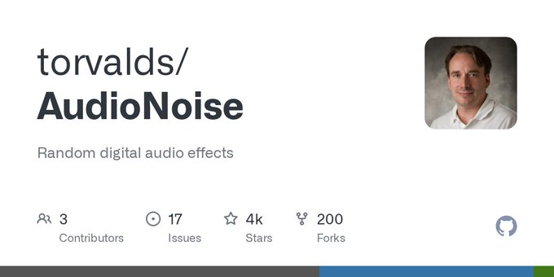
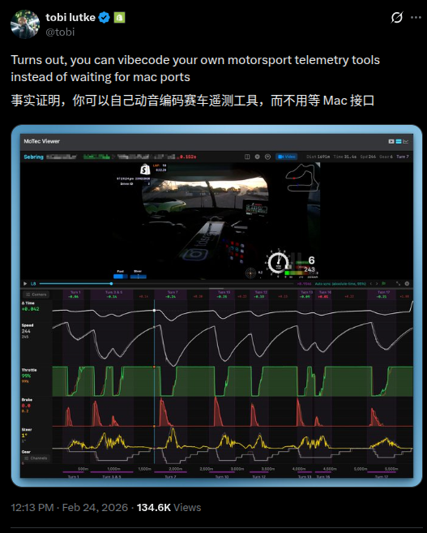
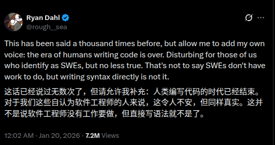
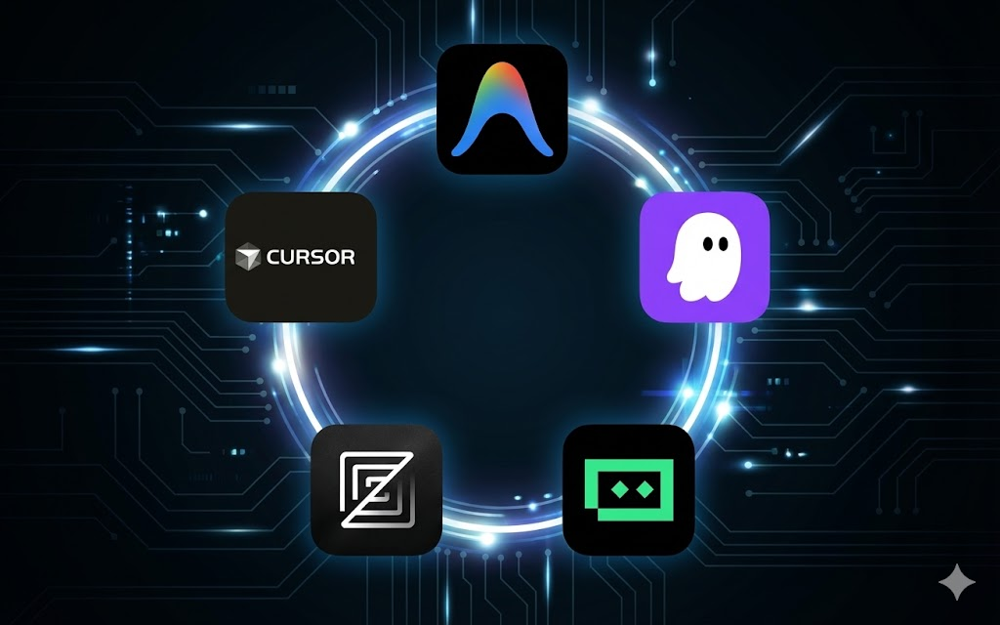
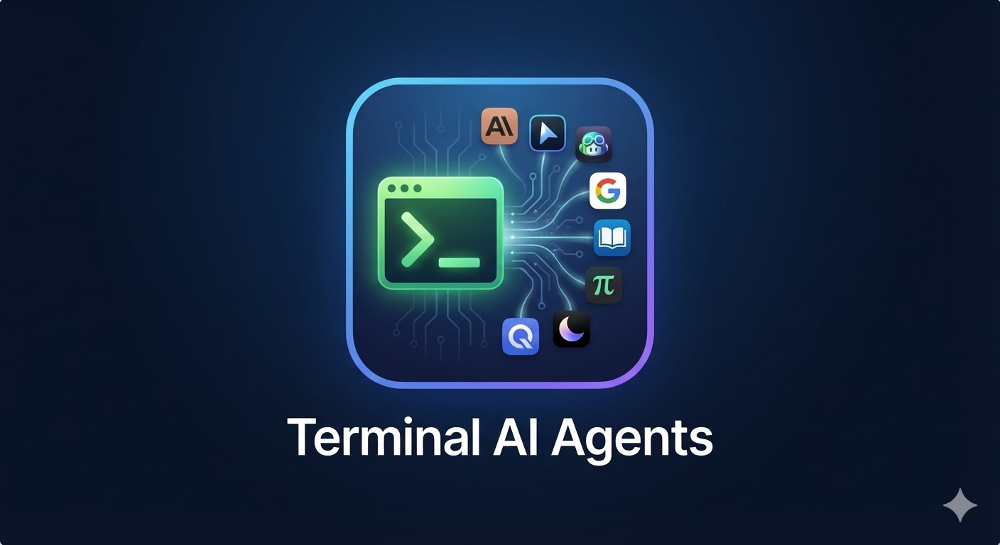
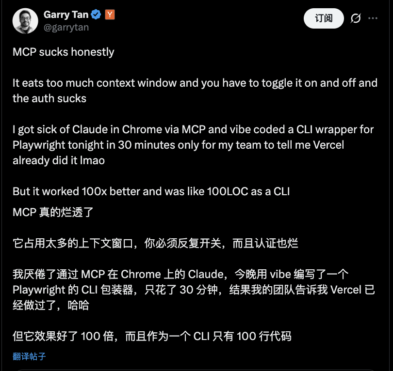
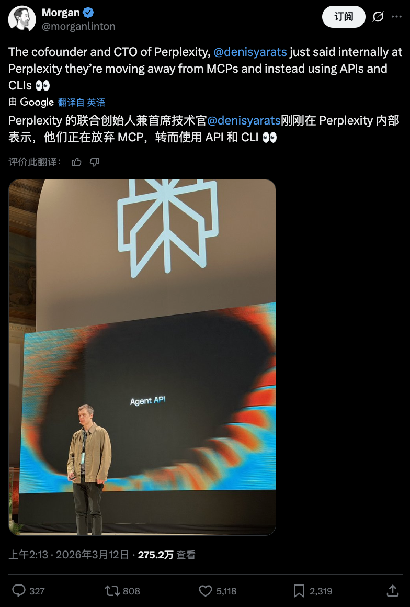
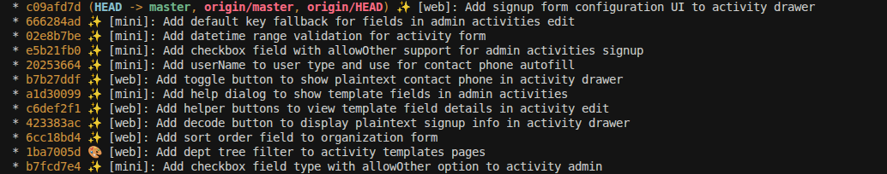

import OpenclawTgChannelImage from '@/assets/vibe-coding/openclaw-tg-channel.png'
import OpenclawWechatReceiveImage from '@/assets/vibe-coding/openclaw-wechat-receive.png'

# Vibe-coding

## What's vibe-coding

什么是 vibe coding?

---

我的理解：

**你只需用自然语言输入你的意图（Vibe），AI 会帮你输出相应的代码，剩下的工作就交给它来完成。**

---

**Andrej Karpathy**（安德烈·卡帕斯）：AI 领域著名专家，被业界昵称为 "KP"，曾任 Tesla AI 总监，OpenAI 创始成员。


https://x.com/karpathy/status/1886192184808149383?lang=en

---

维基百科解释

https://zh.wikipedia.org/wiki/Vibe_coding

---

## Who's vibe-coding?

看看下面这张图


---

**Linus Torvalds**：Linux 之父，Git 的作者



https://github.com/torvalds/AudioNoise#:~:text=basically%20written%20by-,vibe%2Dcoding,-.%20I%20know%20more

---

**Tobi**：Shopify 联合创始人兼 CEO



https://x.com/tobi/status/2026148524140695973, https://github.com/tobi

---

**DHH**：Ruby on Rails 之父


https://x.com/dhh/status/2028463162513871329

---

**Ryan Dahl**：Node.js 和 Deno 的作者



https://x.com/rough__sea/status/2013280952370573666

---

## Awesome vibe-coding projects

[BettaFish](https://github.com/666ghj/BettaFish) 和 [MiroFish](https://github.com/666ghj/MiroFish)：

20 岁大学生花 10 天 VibeCoding 一个开源项目，获盛大资本 3000 万投资

感兴趣的朋友可以去读下作者 BaiFu 的分享：https://mp.weixin.qq.com/s?__biz=MzY4NjA0NjIwMQ==&mid=2247483661&idx=1&sn=243099d64445cb678df265c93226cb78&scene=21&poc_token=HP_It2mjYUFCqSUM2Enc1XrrvBtUR-AFzsiMdMUL

---

[OpenClaw](https://github.com/openclaw/openclaw)

无疑是 2025 年到现在 GitHub 上最火的项目之一


OpenClaw 是奥地利开发者 **Peter Steinberger** 起初当作「playground project」做出来的个人 AI 助手项目，跑在你自己的设备上，并通过 WhatsApp、Telegram、Discord 等聊天软件来收发指令——非常符合 vibe-coding 的典型场景：先把「我要一个能在各种聊天软件里帮我干活的本地 Agent」这个 vibe 丢给代码，再不断迭代。

Peter 已于 2026 年 2 月正式加入 OpenAI，专注于「让普通人也能用上的 Agent」，同时继续以开源的方式推进 OpenClaw 生态，如今已由基金会托管，保持开源开放。

---

[ryOS](https://github.com/ryokun6/ryos)

Cursor 设计负责人 Ryo Lu 用 Cursor 全流程 vibe 出来的「操作系统」—— 在浏览器里跑的怀旧风 OS（复刻 Mac OS X Aqua、System 7、Windows XP/98 等）

内置 17 个应用（Finder、终端、iPod 模拟器、时光机浏览器等）、AI 助手 Ryo、虚拟文件系统与多主题，技术栈为 React 19 + TypeScript + three.js

---

再看看 GitHub 热门榜单：https://github.com/trending?since=monthly

都有一个 [claude](https://github.com/claude) 的头像

## Vibe-coding tools

IDE Extensions, AI-Native IDEs, Terminals, Online SaaS, Others

---

### IDE Extensions

- **GitHub Copilot** (VS Code, JetBrains) - https://github.com/features/copilot：GitHub 官方出的 AI 编程助手，支持补全、重构和注释生成。
- **Cline** (VS Code) - https://marketplace.visualstudio.com/items?itemName=saoudrizwan.claude-dev：在 VS Code 里和 Claude 协作写代码、跑命令、改项目结构的 Agent 插件。
- **Tabnine** - https://www.tabnine.com/ ：早期老牌的本地/云端 AI 补全工具，支持多语言。

---

### AI-Native IDEs



- [Cursor](https://cursor.com/)：基于 VS Code 的 AI 原生 IDE，支持多模型、Agent 模式和项目级重构
- [Antigravity](https://antigravity.google/)：Google 推出的 Agent-first IDE，深度集成 Gemini，支持多智能体协作开发
- [Kiro](https://kiro.dev/)：以规格驱动开发（Spec-Driven）为核心的 AI IDE，背后是 AWS，适合从原型到生产的端到端开发。
- [Zed](https://zed.dev/)：超快原生编辑器，内置协作和 AI 助手，适合需要低延迟的开发体验。
- [Trae](https://www.trae.ai/)：字节系的 AI IDE，支持 Claude、GPT 等模型，偏向全自动写项目和重构。

---

### CLI / Terminals GUI



- [OpenCode](https://open-code.ai/)：面向多模型、多 Agent 的终端 IDE，支持自动运行命令、改代码和管理会话。
- [Claude](https://claude.ai)：Anthropic 出的多模态 AI 助手，也可以配合命令行做代码生成和评审。
- [Codex CLI](https://developers.openai.com/codex/cli/)：OpenAI 推出的终端 AI 代理，可以读写代码、运行命令、做本地开发自动化。
- [Cursor Agent CLI](https://cursor.com/cli)：把 Cursor Agent 搬到终端里，在任意编辑器或纯命令行里 vibe-coding。
- [GitHub Copilot](https://github.com/features/copilot)：GitHub 官方 AI 助手，在终端配合 `gh` 等工具也能辅助开发流程。
- [Gemini](https://ai.google.dev/)：Google 的大模型家族，可通过官方或第三方 CLI 在终端中调用做代码/命令代理。
- [Qwen Code](https://qwenlm.github.io/qwen-code-docs/)：阿里出品的开源代码智能体，支持通过 CLI 对整个项目进行分析和修改。
- [Kimi CLI](https://github.com/MoonshotAI/kimi-cli)：MoonshotAI 官方终端 Agent，支持读写代码、执行命令和接入多种编辑器。
- [pi.dev](https://buildwithpi.ai/)：极简风格的开源终端 Agent，只带少量基础工具，适合自定义扩展和 embedding 到其他系统。

---

### Online SaaS

- [v0.dev](https://v0.dev)：Vercel 推出的文本到前端工具，在浏览器里用自然语言直接生成 React/Next.js 界面。
- [Replit Agent](https://replit.com/agent)：在网页里通过 Agent 生成、修改、运行代码，适合快速原型和教学场景。
- [Google Studio](https://aistudio.google.com/)：Google 推出的 AI 开发平台，支持通过 Agent 生成、修改、运行代码。
- [OpenHands](https://openhands.dev/): 云端运行 Agentic 开发
- [Bolt.new](https://bolt.new)：StackBlitz 旗下的 AI Web IDE，支持一键从 Prompt 生成全栈应用并在线预览、迭代。
- Cursor, Codex, Claude 都支持 Cloud 模式运行 Agentic 开发

---

### Others

- [Conductor](https://www.conductor.build/)：在本地 Mac 上跑一支 AI 编码 Agent 团队，自动帮你在多个工作区并行改代码、跑测试和提 PR。
- [cc-switch](https://github.com/farion1231/cc-switch)：一个统一管理 Claude Code / Codex / OpenCode / Gemini CLI 的桌面工具，用来切换模型提供方、MCP/Skills 和系统 Prompt。


## Spec-Driven Development

SDD: Spec-Driven Development, 规格驱动开发

---

[Superpowers](https://github.com/obra/superpowers)


一套面向 AI Agent 编程的[技能框架](https://github.com/obra/superpowers?tab=readme-ov-file#skills-library)与[软件开发方法论(工作流)](https://github.com/obra/superpowers?tab=readme-ov-file#the-basic-workflow)，强调用**技能驱动**需求澄清、方案设计、实现计划和代码审查。

- /brainstorm（头脑风暴）：在写任何代码之前使用。它会启动“苏格拉底式设计”，通过不断向你提问来完善粗糙的想法，探索替代方案，并最终保存一份设计文档。
- /write-plan（编写计划）：根据设计文档，让 AI 生成详细的分步实施计划。
- /execute-plan（执行计划）：按照计划一步一步执行，并在过程中自动调用所需的技能（如 TDD 编写测试、前端设计规范等）。


---

[GitHub Spec Kit](https://github.com/github/spec-kit)

GitHub 开源的 Spec-Driven Development 工具包（Specify CLI + /speckit 工作流），强调先规格、后实现、分阶段与 AI 协作。

---

**核心思想可以概括成一条闭环：** 

无论是 Superpowers 还是 Spec Kit，

- 都是先和 Agent **澄清需求**，把要做的事落成一份具体的 **spec**，并**持久化到代码仓库**（随分支、PR、版本一起演进）。
- 你点头之后，再产出 **plan/tasks List**（实施计划），让 Agent **按计划写代码**
- 最后做 **review**
- 有新需求或审查发现问题，就回到「澄清 → spec → plan → 实现 → review」，循环往复。

---

## Ralph Loop

前一段时间在 AI 辅助编程圈里很火的一种做法，名字来自《辛普森一家》里的 **Ralph Wiggum(拉尔夫·韦根)**。创造者 [Geoffrey Huntley](https://ghuntley.com/ralph/) 用一句话概括：**「Ralph 就是一个 Bash 循环。」** 最简形式就是反复把同一份提示交给 Agent，让它在仓库里推进任务，直到满足退出条件（例如测试全绿、验收清单完成或达到最大轮次）：

```bash
while :; do cat PROMPT.md | claude-code ; done
```

**和「一条对话聊到底」的差别：** 每一轮往往是**新开会话、干净上下文**，避免长对话里工具调用、旧错误堆叠造成的 **context rot**（上下文劣化）。进度不靠模型「记住聊过什么」，而靠 **仓库里的真实状态**：代码、测试、`git` 历史、进度文件、spec——这和上一节「spec → plan → 实现 → review」的外化思路是同一类工程化：**状态在文件里，退出条件明确，可重复跑**。


交互式：[snarktank.github.io/ralph](https://snarktank.github.io/ralph/)

参考阅读：

- [The Loop | ralph (wiggum.dev)](http://wiggum.dev/concepts/the-loop/) — 逐步拆解循环、状态外化、为何「同一 prompt」不会原地打转  
- [Ralph Wiggum as a software engineer](https://ghuntley.com/ralph/) — 原始叙述与 Bash one-liner；文中也有「Ralph 技术」示意图  
- [snarktank/ralph](https://github.com/snarktank/ralph) — 可落地的 Bash 循环实现（Amp / Claude Code），用 `prd.json`、`progress.txt` 与 git 做轮次间记忆；仓库附带 [**交互式流程图**](https://snarktank.github.io/ralph/)  
- [vercel-labs/ralph-loop-agent](https://github.com/vercel-labs/ralph-loop-agent) — 基于 AI SDK 的外层循环参考实现，README 带结构示意图（见下）  

---

[karpathy/autoresearch](https://github.com/karpathy/autoresearch)

是一个“让 LLM/Agent 自己做研究”的实验框架：它把你要做的事缩成一个反复跑实验、用指标说话、好就保留坏就丢弃的循环。

具体来说，每一轮它会在仓库里（主要是允许修改 train.py）做一次代码改动 -> 用单 GPU 跑一个固定时间预算（约 5 分钟） -> 用 prepare.py 里的评估器算出 val_bpb（越低越好） -> 然后根据结果决定“保留改动并前进分支”还是“放弃并回滚到原点”，循环继续直到人为中断。

autoresearch 和 ralph loop 可谓是“异曲同工”：同样是把推进交给可重复、可验证的循环（好就前进，差就回滚），只是它把循环具体化成了 ML 实验的选择器

## MCP & SKILLS

[MCP](https://modelcontextprotocol.io/) & [SKILLS](https://agentskills.io/)

这两个是 AI Agent 的标配，一个是标准化的接口，一个是标准化的技能库

## SKILLS

为智能体提供新能力与专业知识的一种简单、开放的格式。

----

**SKILL 的文件夹结构**

本质上是包含 `SKILL.md` 文件的文件夹，下面是一个示例：

```bash
my-skill/
├── SKILL.md          # Required: instructions + metadata
├── scripts/          # Optional: executable code
├── references/       # Optional: documentation
└── assets/           # Optional: templates, resources
```

**SKILL.md 的组成**

| 部分             | 说明                              |
| ---------------- | --------------------------------- |
| **Metadata**     | 元数据：name, description 等      |
| **Instructions** | 指令：自描述、可扩展、可移植      |
| **Resources**    | 资源：scripts, references, assets |

**指令的核心特性**

- **Self-documenting 自描述** — 用自然语言描述，作者和用户都能理解
- **Extensible 可扩展** — 从简单文本指令到复杂代码执行、资源管理
- **Portable 可移植** — 就是一个文件夹，轻松修改、版本迭代和分享

---

**SKILL 是如何工作的？**

**渐进式披露 (Progressive Disclosure)**


**三个阶段详解**

1. **Discovery 发现** — Agent 启动时，只加载所有 SKILL 的元数据 (name, description)。Agent 只需知道什么任务用哪个 SKILL。

2. **Activation 激活** — 当 Agent 执行任务时，上下文匹配到元数据描述的 SKILL，此时才加载完整的 SKILL.md 到上下文中。

3. **Execution 执行** — Agent 根据 SKILL.md 指令，按需加载引用文件或执行指定代码。

---

**社区更看好 SKILLS**

YC CEO 抨击 MCP



perplexity 宣布移除 MCP 支持



---

现在大部分软件、框架和 SaaS 服务也会提供 MCP，或支持 skills，比如 Cursor、Claude、Gemini 等。

## CLI skills

跨平台工具：skills

不同 Agent 需要放到不同目录，规则各异。可使用 skills CLI 工具：

```bash
npx skills add vercel-labs/agent-skills --skill web-design-guidelines
npx skills add https://github.com/michalparkola/tapestry-skills-for-claude-code/tree/main/article-extractor
```

## Popular skills

可以去 [skills.sh](https://skills.sh/) 或者 [GitHub](https://github.com/search?q=topic%3Askill+topic%3Askills&type=repositories&s=stars&o=desc) 上搜索一些流行的 skills

例如： openclaw 内置的一些 [skills](https://github.com/openclaw/openclaw/tree/main/skills)

一些有意思的 skills:

- https://github.com/garrytan/gstack
- https://github.com/tanweai/pua
- https://github.com/slavingia/skills

## Write your own skills

- https://github.com/yuler/skills
- https://github.com/yuler/dotfiles/blob/main/bin/aicommit


**skill: ai-commit**



**skill: crawl-x, system-macro**

<div class="flex flex-row gap-4">
  
  
</div>

## Git worktree

在日常开发中，如果你会同时用到多种工具、多个 AI Agent，最好避免大家「抢同一组文件」导致冲突。这时候就可以善用 `git worktree`：为同一个仓库快速创建多个独立工作目录，每个 worktree 绑定一个分支，各干各的。

简单说，`git worktree` 能让你：

- 为不同任务快速开一块干净的工作区，用完就删，不污染主仓库目录。
- 同时在多个分支/工作区上开发、调试和试验，而不用频繁 `stash`/`checkout`。

结合 AI 工具的一个好用法是：把每个 AI Agent 当作一个「数字员工」，给它分配一个专属 worktree 和分支，让它在自己的工作区里改代码、跑测试、提交 commit。我们作为「人类 tech lead」只需要负责分配任务、协调工作、进行人工 review 和合并即可。

- 在主仓库开/删对应的 worktree，分配任务。
- 让不同 Agent 在各自的 worktree 里并行工作。
- 等 Agent 完成后，把对应分支提交上来，再进行人工 review 和合并，形成一条串起来的工程化工作流。

我自己的日常用法可以通过编写 shell function 来实现：[git-worktree functions](https://github.com/yuler/dotfiles/blob/main/.functions#L56-L91) `gwa`, `gwd` 快速创建和删除 worktree

## Voice Inputs

通过语音输入，打字速度可以从每分钟 45 字提升到 220 字 (根据统计)，大幅加快了 vibe-coding 的效率

- [Typeless](https://typeless.info/)：跨应用的 AI 语音输入工具，在 VS Code、浏览器等任意输入框里直接把你的口语整理成高质量文本。
- [闪电说](https://shandianshuo.cn/)：国产本地优先的 AI 语音输入法，比键盘更快，自动去除口头禅、纠正错别字，适合长文本/指令输入。
- [Handy](https://handy.computer/)：开源跨平台语音输入工具，基于 Whisper 等模型在本地转写语音，按下快捷键说完就把文字粘贴到当前光标处。

## Show time: vibe-coding demo

TODO:

来，咱们先现场演示一个简单的 vibe-coding 例子

```text
请生成一个单文件的前端页面这个当前文件（index.html，纯原生 JS + CSS，不要任何依赖）, 输出到当前目录的 `dist/index.html`
```

---

```text
帮我用系统默认浏览器打开这个文件预览下
```

---

使用 gh 帮我创建一个仓库

---

## Code review by AI

集成到 GitHub PR 用 AI 做 code review 的方案：

- **[GitHub Copilot for Pull Requests](https://docs.github.com/en/copilot/how-tos/use-copilot-agents/request-a-code-review/use-code-review)**：GitHub 官方，在 PR 中生成描述、建议 commit message、识别潜在问题，与 Issues/Projects 打通。
- **[Google Code Assist](https://developers.google.com/gemini-code-assist/docs/review-github-code)**: Google 官方出的 AI 代码审查工具，支持自动生成代码审查报告、识别潜在问题、建议改进方案。
- **[Cursor BugBot](https://cursor.com/bugbot)**: Cursor 官方出的 AI 代码审查工具，支持自动生成代码审查报告、识别潜在问题、建议改进方案。

## 番外：OpenClaw

首先这个项目就是 Vibe-Coding 出来的，刚刚上面也提到了

**传统的 Vibe-coding（如 Cursor、Windsurf）：** 是**主动式**的。你必须坐在电脑前，打开 IDE，输入 Prompt，然后盯着它改代码。你依然在"工作流"的中心。

有了 OpenClaw，Vibe-coding 的场景变了。你可以在下班路上，掏出手机在 Telegram 里给你的 OpenClaw 发一条消息：*「帮我在本地跑一个 Redis 容器，然后把我刚才想到的那个购物车逻辑用 Python 写出来，测试通过后发个截图给我。」* 它会在你的老旧主机或 VPS 上默默执行一切。它让人类彻底脱离了 IDE 的物理束缚。

可以和前面之前提的几个 Cloud Agentic 开发有点类似，但是他是跑再你个人设备上，你可以赋予他更多的权限

## OpenClaw is risk

Design OpenClaw prompt injection attack

## OpenClaw alternatives

- [nanoclaw](https://github.com/qwibitai/nanoclaw)
  https://x.com/karpathy/status/2024997757757653224
- [ironclaw](https://github.com/nearai/ironclaw)

## 通过代码转包查看 claude 发送的内容

::TODO: ::

使用本地代理抓包来运行 Claude

```bash
http_proxy=http://127.0.0.1:8888 https_proxy=http://127.0.0.1:8888 claude
```

refs: https://askubuntu.com/questions/73287/how-do-i-install-a-root-certificate

```bash
sudo openssl x509 -in charles.pem -inform PEM -out charles.crt
```

或

```bash
openssl x509 -inform DER -in charles.cer -out charles.crt
```
